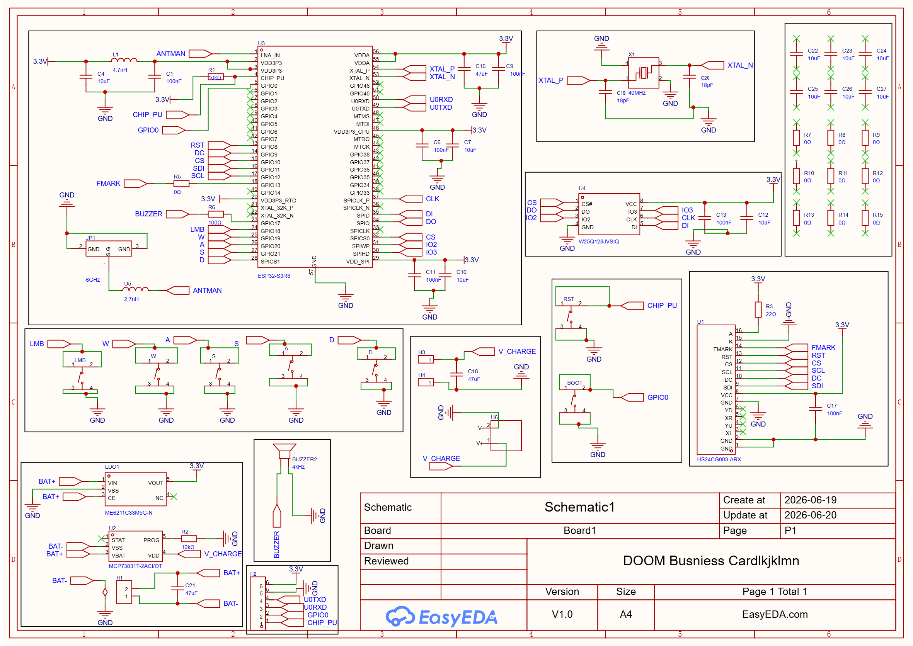
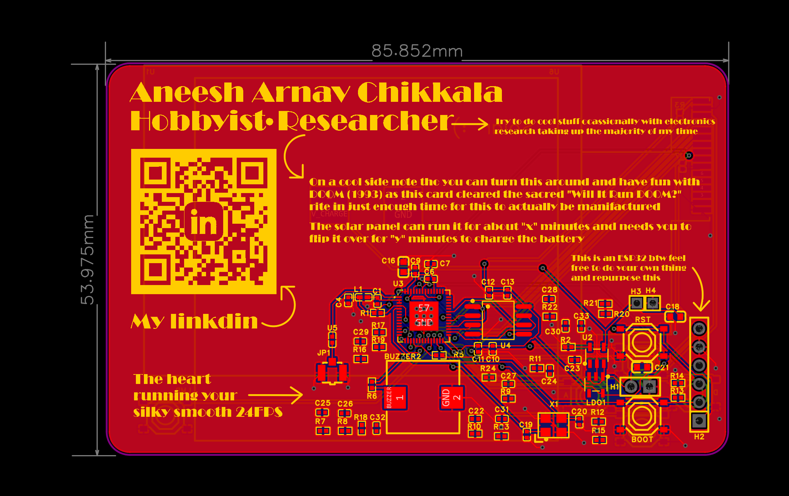

# A Business Card that plays DOOM !

A Business Card Sized PCB with a fully function microcontroller circuit to run DOOM off a tiny in built battery that self sustains with a solar panel.

# How does it work ? 

Its a relatively simple PCB with an ESP32S3 wired up to an ST7789T3 based display, powered by a generic 100mAH LiPo Sustained by an 300mW 6V Solar Panel manufactured by Voltatic. When functioning properly you should be able to play a ported version the 1993 classic DOOM.

# Why did i make it ?

This idea was a culmination of several thoughts accumulated through a mix of Instagram reels and boredom. The thought began when i saw a creator ( @StuckAtPrototype ) make a business card out of PCB's with a mostly as a meme cause the price differential between getting them printed in bulk off stock paper or FR4 wasn't that much ( W's for JLCPCB ). He Also implemented a tiny makeshift displays with LED's. With me being the reasonable person I am instantly had a daunting question, WILL IT DOOM ? I knew i could easily get the compute I need but power delivery was my primary factor of consideration, which i eventually did address.

# Components Required for the build

Now as much as I would love for any one reading this to recreate this, PLEASE modify the PCB to serve your personality and self. I made the Silkscreen with myself in mind and hence it has my full name and LinkedIn.   On the Hardware end of things , this is the BOM : 

| No. | Quantity | Description                              | Supplier       | Supplier Part | Product Link                                                 | Cost   | Total (USD) |
|-----|----------|------------------------------------------|----------------|---------------|--------------------------------------------------------------|--------|-------------|
| 1   | 7        | SMD Buttons for Input                    | LCSC           | C318884       | https://www.lcsc.com/product-detail/C318884.html             | 0.0198 | 0.1386      |
| 2   | 1        | Buzzer for some sembelence of Audio      | LCSC           | C255330       | https://www.lcsc.com/product-detail/C255330.html             | 0.7049 | 0.7049      |
| 3   | 6        | 100nF 0402 Capacitors                    | LCSC           | C131394       | https://www.lcsc.com/product-detail/C131394.html             | 0.0059 | 0.0354      |
| 4   | 16       | 10uF 0402 Capacitors                     | LCSC           | C315248       | https://www.lcsc.com/product-detail/C315248.html             | 0.0406 | 0.6496      |
| 5   | 3        | 47uF 0402 Capacitors                     | LCSC           | C730416       | https://www.lcsc.com/product-detail/C730416.html             | 0.1236 | 0.3708      |
| 6   | 2        | 18pF 0402 Capacitors                     | LCSC           | C106202       | https://www.lcsc.com/product-detail/C106202.html             | 0.0036 | 0.0072      |
| 7   | 1        | WIFI antenna attachment                  | LCSC           | C88374        | https://www.lcsc.com/product-detail/C88374.html              | 0.1089 | 0.1089      |
| 8   | 1        | 4.7nH 0402 Inductor                      | LCSC           | C275292       | https://www.lcsc.com/product-detail/C275292.html             | 0.0316 | 0.0316      |
| 9   | 1        | LDO regulator for solar power regulation | LCSC           | C82942        | https://www.lcsc.com/product-detail/C82942.html              | 0.0509 | 0.0509      |
| 10  | 2        | 10KΩ 0402 Resistors                      | LCSC           | C190095       | https://www.lcsc.com/product-detail/C190095.html             | 0.0207 | 0.0414      |
| 11  | 1        | 22Ω 0402 Resistors                       | LCSC           | C2929994      | https://www.lcsc.com/product-detail/C2929994.html            | 0.0015 | 0.001       |
| 12  | 19       | 0Ω 0402 Resistors                        | LCSC           | C106231       | https://www.lcsc.com/product-detail/C106231.html             | 0.0012 | 0.0228      |
| 13  | 1        | 100Ω 0402 Resistors                      | LCSC           | C106232       | https://www.lcsc.com/product-detail/C106232.html             | 0.0012 | 0.0012      |
| 14  | 1        | 320x240 ST7789 driven Display            | LCSC           | C5329583      | https://www.lcsc.com/product-detail/C5329583.html            | 3.6412 | 3.6412      |
| 15  | 1        | Solar battery charge regulation          | LCSC           | C424093       | https://www.lcsc.com/product-detail/C424093.html             | 0.7875 | 0.7875      |
| 16  | 1        | ESP32S3 Microcontroller                  | LCSC           | C2913194      | https://www.lcsc.com/product-detail/C2913194.html            | 3.3136 | 3.3136      |
| 17  | 1        | Serial flash memory                      | LCSC           | C97521        | https://www.lcsc.com/product-detail/C97521.html              | 2.4553 | 2.4553      |
| 18  | 1        | 2.7nH 0402 Inductor                      | LCSC           | C7295850      | https://www.lcsc.com/product-detail/C7295850.html            | 0.125  | 0.125       |
| 19  | 1        | 40MHz 15pF Crystal                       | LCSC           | C9010         | https://www.lcsc.com/product-detail/C9010.html               | 0.1113 | 0.1113      |
| 20  | 1        | 0.3W 6V Mini Solar Panel                 | Voltatic       | P122          | https://voltaicsystems.com/0-3-watt-6-volt-solar-panel-etfe  | 5.99   | 5.99        |
| 21  | 1        | 90 mAH 3.7V battery                      | lionbattery.in | WLY401030     | https://lionbattery.in/shop/shop/new-added-product/wly401030 | 1.08   | 1.08        |
| 22  | 1        | FR4 1.6mm 1 Oz Copper PCB                | JLCPCB         | NA            | https://cart.jlcpcb.com/quote                                | 1.8    | 1.8         |
|     |          |                                          |                |               |                                                              | Total  | 20.3882     |


# PCB and Schematic 

I designed it in EasyEDA Pro. You can find the Gerber files in the repo, please change the QR Code and the personal stuff to whatever aligns with your "Larp goals". The schematic and PCB's looks like : 






# Power requirements

The board is powered primarily by a lil 3.7V 90mAH battery that survives and retains its juices from a Solar panel. Specifically , a mini Voltatic solar panel rated for 6V at 0.3W.

The board while running Doom at a glorious 24FPS can survive for about 8 minutes on a 30 minute solar charge which is a near 1:3 ratio for charge to playtime which isn't even that bad for solar powered retro consoles with everything accounted for. 

# Modifying the PCB 

This PCB as i reiterate again was made for me (the author) personally , hence if will not apply for everyone , if you ever do wanna recreate this project or even repurpose one that I've given to you, you can either just use it for the ESP it is with the JTAG connector to use it as a webserver or any plethora of similar activates or if your really bored , you could port a whole retro game into this mini console which definitely would be a cool addition. 

- To modify the PCB , Open the EPRO file and open it with KiCad , there you can modify silkscreen elements without affecting the primary circuitry. If it however does Fail DRC , which is a common error with source files , you pretty much have no choice but to manually redo the layout for peace of mind or take a gamble on the PCB traces. 
- To port games , definitely do check out [This Repo](https://github.com/Circuit-Digest/ESP32-Retro-Game-Console) , it documents a method to port NES and GBC colour games .
# Assembly 
Please do note that these assembly instructions are not final and can change. I've yet to build it, and when I do, I'll update this section to be more accurate. In the meanwhile, don't be afraid to change things up or make use of the several exposes GPIO pins/testing pad to make any modifications you would like to make. 

Note : Soldering Instructions are SUGGESTIONS and are typically personal preference , If your used to doing things a certain way , do not change it. I personally tend to do SMD components close to THT components first , followed by the THT components . Additionally , if you wanna build this board for the sake of emulating doom on any old retro console or such , feel free to use the pick and place file to get the board pre assembled as 0402 can be a pain to hand solder.

Soldering this will be quite the adventure as there's elements on both the front and back meaning you only get complete freedom of assembly on one axis.

1. It is highly recommended to use a SMD Soldering Stencil with the bottom side facing up. The bottom side only has 7 components on it but the solar panel has 2 relatively massive invisible soldering pads which cant be soldered on any other way 
2. Spread a thin layer of Solder onto the PCB Aligning the Stencil with the copper pads
3. Using a arrowhead or needle nose tweezers, place the components of the boards onto their respective designators and if the part has polarity, do take that into account 
4. Now you don't wanna rush this but please try to keep the placing components parts of this procedure under 10 minutes as solder can very much dry up way too quickly , especially lead free solder or solder with a relatively low flux content.
5. Once your sure that every component is precisely where its supposed to be, Place the PCB on a PCB Hotplate or any surface your willing to sacrifice with a hot air gun reigning down hell while you do the soldering 
6. Start up what ever machine your using and tune the temperature along with whatever temperature curve the solder your using recommends. 
7. The actual soldering should only take about a minute followed by a couple minutes for the PCB to cool down . DO NOT TOUCH IT , IT WILL BURN YOU. 
8. Once it cools down , grab onto the PCB with some sort of tweezer/pliers , verify the integrity of the connections by checking for continuity with a multimeter. Flip it over with some sort of soft heat resistant cushion on the back to safeguard the components.
9. From here on out , its good'ol hand soldering usually taking the BOM as the primary reference. 
10. Inspect everything with your eyes , looking at every component individually. Its recommended to use an Multimeter or an LCR meter to just sanity check all of the values and check for continuity on all of your passives.
11. Use some Isopropanol to clean the Flux and solder residue off the board and connect it to a power source to make sure it doesn't explode.
12. Connect both of the boards to 5V of power and use a multimeter to check for signal continuity and voltage stability on the 5V , 3.3V , 1.1V test pads. 
 
# The Architecture at a glance 

It runs a ported version of espDOOM and doomgeneric ported to an ESP32S3 rendering the images on a ST7789 driven OLED. 

# Setting up the firmware 

In this repo , I will be documenting the usage of a semi custom/modified repo of doomgeneric running on espdoom firmware but that is no where near the limit for such devices. Its advised to use this as a step to take reference from while porting your own games from other consoles to newer generation ESP32's 

The firmware is split into 2 blocks of code which are automatically flashed and programmed into your board given you have the Arduino CLI and ESP IDF CLI installed. 

 Software dependencies: -
- arduino-cli
- the ESP32 board core
- Adafruit ST7735 and ST7789 Library 
- Adafruit GFX Library 
- Adafruit BusIO
- mingw
- ESP IDF and ESP EIM 
- msys64

For reference , here is every file and its purpose : 

| File/Folder            | What it is                                                  |
| ---------------------- | ----------------------------------------------------------- |
| FLASH-DOOM.bat         | Run it to flash everything onto the ESP32S3                 |
| flash.ps1              | Flash support file                                          |
| Firmware.ino           | Arduino sketch with display logic and button implementation |
| src/doom/              | Actual doomgeneric engine                                   |
| partitions.csv         | Flash partition layout                                      |
| data/DOOM1.WAD         | Doom game data from espdoom                                 |
| TFTTest/RUN-TEST.bat   | Run in it to flash a display/button test file               |
| TFTTest/flash-test.ps1 | Flash support filer                                         |
| TFTTest/TFTTest.ino    | Arduino sketch with display logic and button implementation |

Hardware Assumptions and Button Configuration:

Feel free to change for any skews or tweaks you might want to make 

```cpp

// OLED Wiring
#define PIN_TFT_SCLK 12
#define PIN_TFT_MOSI 11
#define PIN_TFT_CS   10
#define PIN_TFT_DC    9
#define PIN_TFT_RST   8
#define PIN_TFT_BL   -1      

  
// buttons 
#define PIN_BTN_UP    19
#define PIN_BTN_LEFT  20
#define PIN_BTN_RIGHT 21
#define PIN_BTN_DOWN  22
#define PIN_BTN_FIRE  18

  
// If your buttons are wired to 3V3 instead of GND, set this to 0.
#define BTN_ACTIVE_LOW 1

// set resolution
#define FB_W   DOOMGENERIC_RESX     
#define FB_H   DOOMGENERIC_RESY  
```

One time Flashing setup : - 

1) Plug the board into USB. (If the screen is blank/unrecognized, hold **BOOT**,  tap the **RESET**, release **BOOT** to force download mode.)
2) double click the **`FLASH-DOOM.bat`** file. 

### Known limitations (inherited from the port)
By nature of the porting and retro video game scene , this list shall be ever-growing but some of the obvious limitations inherited from the primary port sources are : 
- No save/load 
- No DOOM2 (needs DOOM1 wad along with save data which exhausts game save data)

# Files 


# Zine


